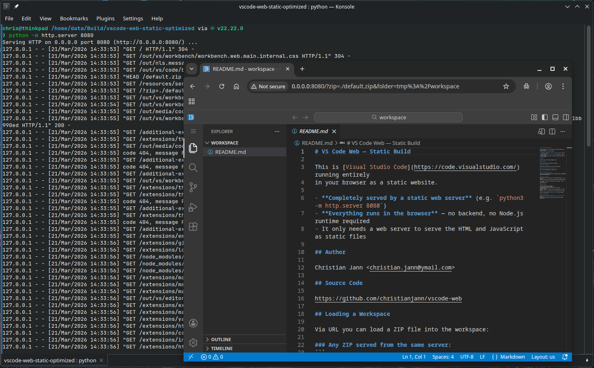

# VS Code Web Build — What Has Been Done

## Goal
Build VS Code for the browser and serve it from a plain static web server.



The online version served via GitHub pages can be seen at [https://christianjann.github.io/vscode-web/](https://christianjann.github.io/vscode-web/).

---

## Command Summary (in order)

### 1. Install dependencies
```bash
npm install                          # ~6 min
```
Installs all Node.js dependencies for the VS Code project.

### 2. Download built-in extensions from marketplace
```bash
npm run download-builtin-extensions
```
Downloads prebuilt extensions (e.g. js-debug) into `.build/builtInExtensions/`.
This runs automatically as part of `code-web.sh`, but can be run manually.

### 3. Compile for development (`out/`)
```bash
npm run transpile-client             # ~10s, fast esbuild transpile
# OR
npm run watch-web                    # watch mode — recompiles on changes
```
Transpiles TypeScript sources into `out/` (unminified, un-mangled).
This is what `code-web.sh` serves for local development.

### 4. Run the dev web server (for testing)
```bash
./scripts/code-web.sh               # serves from out/ on localhost:8080
```
Uses `@vscode/test-web` to serve VS Code from the repo's `out/` directory.
Dynamically generates HTML with configuration injected at runtime.

### 5. Compile for production builds (`out-build/`)
```bash
npm run gulp compile-build-with-mangling     # ~50s, with name mangling
# OR
npm run gulp compile-build-without-mangling  # ~4 min, no mangling
```
Compiles TypeScript into `out-build/` with property mangling for smaller output.
This is the prerequisite for all minify/package tasks below.

**Fix required:** `chatDebugEditor.ts` had `override setEditorVisible(...)` without `protected`, which widened the visibility and broke the mangler. Fixed by adding `protected`.

### 6. Bundle and minify for Remote Extension Host Web
```bash
npm run gulp minify-vscode-reh-web           # bundles out-build/ → out-vscode-reh-web-min/
```
Reads from `out-build/`, bundles entry points with esbuild, and minifies.
This is the web server backend bundle (not the standalone web client).

### 7. Package Remote Extension Host Web for Linux x64
```bash
npm run gulp vscode-reh-web-linux-x64-min    # ~2 min
```
Full pipeline: compile → bundle → minify → package into `../vscode-reh-web-linux-x64/`.
This is the "VS Code Server" for web — requires Node.js to serve.

### 8. Package standalone VS Code Web client → `../vscode-web/`
```bash
npm run gulp vscode-web-min                  # ~1 hour
```
**This is the command that created `<build dir>/vscode-web/`.**

Full pipeline: `compile-build-with-mangling` → `compile-web-extensions-build` → `esbuild-vscode-web-min` (bundle+minify) → `packageTask` → writes to `../vscode-web/`.

The output path is `BUILD_ROOT/vscode-web` where `BUILD_ROOT` is the parent of the repo root (`<build dir>/`), so the output lands at `<build dir>/vscode-web/`.

The `vscode-web` package is the official production web client. It contains:
- `out/` — minified + bundled JS/CSS
- `extensions/` — compiled web extensions
- `node_modules/` — production dependencies
- `package.json`, `favicon.ico`, `manifest.json`

**Note:** Despite being a "web" build, it still needs a Node.js server to dynamically generate the HTML entry point with configuration injected.

---

## Custom Static Packaging Script (no Node.js server needed)

Because the official `vscode-web` output still requires a dynamic server, we created custom scripts that produce fully self-contained static directories:

### Dev Build (unoptimized)
```bash
npm run transpile-client                     # compile to out/
node scripts/package-web-static.js           # package → ../vscode-web-static/
cd ../vscode-web-static && python3 -m http.server 8080
```

### Optimized Build (minified)
```bash
npm run gulp vscode-web-min                  # ~1 hour → ../vscode-web/
node scripts/package-web-static-optimized.js # package → ../vscode-web-static-optimized/
cd ../vscode-web-static-optimized && python3 -m http.server 8080
```

The script (`scripts/package-web-static.js`) does:

1. Copies `out/` (compiled JS/CSS)
2. Patches `webview/browser/pre/index.html`:
   - Skips hostname hash validation (plain servers can't do UUID subdomains)
   - Changes CSP from `sha256-...` to `'unsafe-inline'` (since the script was modified)
3. Copies `extensions/` and `.build/builtInExtensions/`
4. Bundles a custom `workspace-loader` extension (loads ZIP files into in-memory FS)
5. Copies `resources/server/` (favicon, manifest, icons)
6. Scans extensions for web-compatible ones using `isWebExtension()` logic
7. Generates `index.html` with:
   - Product configuration (without `commit` — see below)
   - Builtin extensions metadata in `<meta>` tag
   - CSS modules import map
   - Dynamic webview endpoint override (same-origin)
   - ZIP workspace loader redirect

### Key Issues Solved

| Problem | Root Cause | Fix |
|---------|-----------|-----|
| Mangler error during `compile-build-with-mangling` | `chatDebugEditor.ts` widened `setEditorVisible` from `protected` to `public` | Added `protected` modifier |
| Blank page with `code-web.sh` | `compile-build-*` writes to `out-build/`, but `code-web.sh` serves `out/` | Run `npm run transpile-client` instead |
| No themes in picker | `extensionPath` was `extensions/theme-defaults` instead of `theme-defaults` | Fixed scanner to use folder name only |
| No extensions loaded at all | `commit` was set → `isBuilt=true` → used empty hardcoded array | Set `commit: undefined` in product config |
| CORS errors on webview resources | Webviews loaded from `vscode-cdn.net`, fetched back to localhost | Override `webviewEndpoint` to same origin |
| Webview hostname validation error | `pre/index.html` expects UUID hash as hostname | Patched to `if (true)` in output |
| CSP blocks modified inline script | SHA-256 hash no longer matches patched script | Changed CSP to `'unsafe-inline'` |

### Output Sizes
- `../vscode-web-static/` — ~1.8 GB (unminified dev build with all extensions)
- `../vscode-web/` (from `vscode-web-min`) — production minified build

---

## Phase 4: Optimized Static Packaging

### Goal
Package the optimized/minified `vscode-web-min` build into a self-contained static directory that can be served by any plain web server, without requiring Node.js.

### The Problem
The `npm run gulp vscode-web-min` command creates `../vscode-web/` with:
- Minified + bundled JS/CSS (`out/`)
- Compiled web extensions (`extensions/`)
- Production dependencies (`node_modules/`)
- Server resources (favicon, manifest, icons)

However, it still requires a Node.js server to dynamically generate the `index.html` with configuration injected at runtime.

### The Solution
Created `scripts/package-web-static-optimized.js` that:

1. **Copies the optimized build** from `../vscode-web/` (instead of building from `out/` + `extensions/`)
2. **Generates a `workbench.js` bootstrapper** — the optimized `web` build target intentionally excludes the shell (`vs/code/browser/workbench/workbench.js`). Only the `server-web` target includes it. The script generates a self-contained bootstrapper that imports `{ create, URI }` from the bundled `workbench.web.main.internal.js` and wires up config + workspace provider inline.
3. **Applies webview patches** — same as the dev version (hostname validation bypass, CSP `'unsafe-inline'`)
4. **Bundles the workspace-loader extension** for ZIP workspace loading
5. **Generates static `index.html`** with:
   - CSS link to the bundled `workbench.web.main.internal.css`
   - NLS messages loading (`out/nls.messages.js`)
   - Product configuration, extension metadata, webview endpoint overrides
6. **Outputs to `../vscode-web-static-optimized/`**

### Key Issues Solved (Optimized Build)

| Problem | Root Cause | Fix |
|---------|-----------|-----|
| `workbench.js` MIME type error (text/html) | Optimized `web` build doesn't include the shell bootstrapper — only bundles `workbench.web.main.internal.js` | Generate a self-contained `workbench.js` that imports `{ create, URI }` from the bundle |
| Missing NLS strings | Optimized build has `nls.messages.js` (sets `globalThis._VSCODE_NLS_MESSAGES`) but HTML didn't load it | Added `<script type="module" src="out/nls.messages.js">` before workbench.js |
| Missing CSS | Bundled CSS wasn't linked | Added `<link rel="stylesheet">` for `workbench.web.main.internal.css` |
| ZIP workspace loading broken — extension never activates | Baked-in `commit` hash in the bundle + `JSON.stringify` dropping `undefined` (see detailed explanation below) | Changed `commit: undefined` to `commit: null` in the packaging script |

#### ZIP Workspace Loading Fix — `commit: undefined` vs `commit: null`

This was a subtle and important bug. The workspace-loader extension was correctly bundled, correctly listed in the HTML `<meta>` tag (81 extensions total), and its files were accessible via HTTP — yet its `activate()` function was never called in the optimized build (while working fine in the dev build).

**The chain of events:**

1. The optimized build's `workbench.web.main.internal.js` has a **baked-in product configuration** via `BUILD->INSERT_PRODUCT_CONFIGURATION` in `src/vs/platform/product/common/product.ts`. This includes `commit:"4fb8242c..."` — the git commit hash at build time.

2. Our packaging script set `commit: undefined` in the HTML config's `productConfiguration`, intending to override the baked-in value.

3. However, `JSON.stringify({commit: undefined})` produces `{}` — **`undefined` is not valid JSON and the key is silently dropped**.

4. At startup, `web.main.ts` merges configs via `mixin(product, productConfiguration)`. Since the HTML config has no `commit` key at all, `mixin()` never overwrites the baked-in commit hash.

5. `isBuilt` is defined as `!!this.productService.commit` — with the baked-in commit still present, `isBuilt = true`.

6. The builtin extension scanner in `builtinExtensionsScannerService.ts` has two code paths:
   - `if (isBuilt)` → uses a **hardcoded extension list** that was injected at build time (which does NOT include workspace-loader)
   - `else` → reads extensions from the **DOM `<meta id="vscode-workbench-builtin-extensions">`** tag (which DOES include workspace-loader)

7. Since `isBuilt` was `true`, the scanner used the hardcoded list, workspace-loader was never discovered, and its `activate()` was never called.

**The fix:** Change `commit: undefined` to `commit: null`. `JSON.stringify({commit: null})` produces `{"commit":null}`, so `mixin()` overwrites the baked-in commit with `null`, making `isBuilt = !!null = false`, and the scanner falls through to the DOM path where it finds all 81 extensions including workspace-loader.

**Key learning:** In the dev build, `product.ts` has `product = {}` (empty object, no baked-in commit) because `BUILD->INSERT_PRODUCT_CONFIGURATION` is not replaced. So `commit: undefined` in the HTML config worked fine — there was nothing to override. The optimized build is fundamentally different because the build pipeline replaces the placeholder with real product data including the commit hash.

### Usage

```bash
# Build the optimized version
npm run gulp vscode-web-min                  # ~1 hour → ../vscode-web/

# Package it for static serving
node scripts/package-web-static-optimized.js  # → ../vscode-web-static-optimized/

# Serve with any web server
cd ../vscode-web-static-optimized && python3 -m http.server 8080
```

### Key Differences from Dev Script
- **Source**: `../vscode-web/` (pre-built optimized) vs `out/` + `extensions/` (dev build)
- **Bootstrapper**: Generates self-contained `workbench.js` (dev build has one already in `out/`)
- **CSS**: Single bundled `workbench.web.main.internal.css` linked directly (dev uses CSS modules import map)
- **NLS**: Loads pre-built `nls.messages.js` (dev build inlines strings)
- **Extensions**: Already compiled and filtered to web-compatible ones
- **Size**: 109M vs 1.8G due to minification and bundling

### Output Comparison
- `../vscode-web-static/` — 1.8G (dev build, all extensions, unminified)
- `../vscode-web-static-optimized/` — 109M (production build, minified, bundled)

Both `../vscode-web-static/` and `../vscode-web-static-optimized/` support ZIP workspace loading and can be served by any static web server.

---

## Summary

We now have two complete static VS Code web builds:

1. **Dev Build** (`../vscode-web-static/` - 1.8G)
   - Fast compilation (~10s)
   - All extensions included
   - Unminified for debugging
   - Full source maps

2. **Optimized Build** (`../vscode-web-static-optimized/` - 109M)
   - Production compilation (~1 hour)
   - Minified and bundled
   - Smaller size, faster loading
   - Same features and extensions

Both can be served by any static web server and support:
- Opening local folders (Chrome/Edge File System Access API)
- Loading ZIP files as in-memory workspaces
- All VS Code web features (extensions, themes, etc.)

The build pipeline is now complete from source to static deployment.

### Ways to Open a Workspace

| Goal | How | Notes |
|---|---|---|
| Edit local files on disk | **File > Open Folder** in Chrome/Edge | Uses the browser's File System Access API — reads/writes directly to disk. Zero config. |
| Scratch space (resets on reload) | Navigate to `?folder=tmp%3A%2Fworkspace` | Opens an empty in-memory folder on the `tmp://` scheme. |
| Load a ZIP from the server | Navigate to `?zip=./demo.zip` | The workspace-loader extension fetches, extracts, and populates `tmp:/workspace`. |
| Load a GitHub repo | Navigate to `?zip=https://codeload.github.com/USER/REPO/zip/refs/heads/main` | Same mechanism — GitHub serves ZIP archives at that URL. |
| Persist edits across reloads | Not yet supported | Would require replacing the in-memory `tmp://` provider with an IndexedDB-backed one. |
| Clone a git repo in-browser | Not yet supported | Could be added via [isomorphic-git](https://isomorphic-git.org/) in the workspace-loader extension. |

### Expected Console Errors/Warnings (Normal)

When running the static builds, the browser console will show several errors and warnings. These are **all expected** and do not affect functionality:

| Console Message | Why It's Expected |
|---|---|
| `Request for font "..." blocked at visibility level 2` | Firefox's font visibility policy blocks access to certain system fonts. Not actionable — browser security feature. |
| `Feature Policy: Skipping unsupported feature name "usb"/"serial"/"hid"/etc.` | VS Code requests hardware permissions that the browser doesn't support. Harmless. |
| `ENOPRO: No file system provider found for resource 'file:///.claude/agents'` (and `.copilot/instructions`, `.copilot/agents`, `.claude/rules`) | Copilot/Claude agent features try to resolve `file://` URIs, but there's no `file://` filesystem provider in pure-web mode. Expected without a backend server. |
| `ERR withProvider → doWatch` (file watcher errors) | Same root cause — no filesystem watcher backend available in static web mode. |
| `Source map error: request failed with status 404` (CDN URL) | The minified bundle has a `//# sourceMappingURL` pointing to `vscode-cdn.net`. The CDN source maps aren't available locally. Not actionable. |
| `The web worker extension host is started in a same-origin iframe!` | Expected when serving without UUID-based subdomain isolation. |
| `An iframe which has both allow-scripts and allow-same-origin...` | Standard browser warning for sandboxed iframes — required for webviews to function. |
| `Ignoring fetching additional builtin extensions from gallery as it is disabled` | No marketplace backend configured — extensions are served locally. |
| `Long running operations during shutdown are unsupported in the web` | Fires when closing/navigating away from the tab. VS Code web can't do async shutdown like the desktop app. |
| `Uncaught (in promise) Canceled: Canceled` | Same — page unload cancels in-flight promises during shutdown. |
| `No service worker controller found` | No service worker registered in static mode. |
| `The character encoding of a framed document was not declared` | The web worker extension host iframe doesn't declare charset. Cosmetic. |
| `Found unexpected null` in webview `hookupOnLoadHandlers` | Pre-existing VS Code bug: race condition in `pre/index.html` where `newFrame.contentWindow` is null after `document.write()`/`document.close()` cycle. Not caused by our patches — same code is in the upstream source. The webview still renders correctly. |
| `Ignoring the error while validating workspace folder tmp:/workspace - file not found` | Workspace validation runs before the workspace-loader extension has finished populating the `tmp:/workspace` folder. The folder is validated again after files are written and works fine. |
| `The file is not displayed in the text editor because it is a directory.` | On page reload, VS Code tries to open the workspace root before the ZIP loader extension has finished extracting files. This message appears briefly and disappears as soon as the files are loaded. Harmless race condition. |

---

## Demo — Try It Out

Both packaging scripts generate a `demo.zip` containing a small sample project (HTML, CSS, JS, VS Code settings). Use it to verify the ZIP workspace loader works:

### Quick Start (Optimized Build)

```bash
# 1. Build (if not done already)
npm run gulp vscode-web-min
node scripts/package-web-static-optimized.js

# 2. Serve
cd ../vscode-web-static-optimized
python3 -m http.server 8080
```

Then open in your browser:

```
http://localhost:8080/?zip=./demo.zip
```

The page redirects once (adding `&folder=tmp%3A%2Fworkspace`), VS Code opens the in-memory folder, and the workspace-loader extension fetches and extracts the ZIP. You'll see a notification when loading is complete.

### Quick Start (Dev Build)

```bash
npm run transpile-client
node scripts/package-web-static.js

cd ../vscode-web-static
python3 -m http.server 8080
```

Then open: `http://localhost:8080/?zip=./demo.zip`

### What's in `demo.zip`

```
demo-project/
├── .vscode/
│   └── settings.json      # editor.tabSize=2, formatOnSave
├── README.md               # project readme
├── index.html              # simple HTML page
├── style.css               # basic styles
└── app.js                  # "Hello from VS Code Web!" script
```

### Other Examples

```bash
# Load your own ZIP (copy it into the served directory first)
http://localhost:8080/?zip=./myproject.zip

# Load a public GitHub repository
http://localhost:8080/?zip=https://codeload.github.com/user/repo/zip/refs/heads/main
```

Files are editable in-memory — changes are lost on page reload.

To open a **local folder from disk** instead (Chrome/Edge only), simply navigate to `http://localhost:8080/` and use **File > Open Folder**.

---

## ZIP Workspace Loader — Opening a Folder from a ZIP File

### Goal
Open a project from a ZIP file (local or remote URL) as an editable in-memory workspace in the static VS Code web build, without requiring a dynamic server.

### How It Works

1. Navigate to `http://localhost:8000/?zip=./myproject.zip`
2. `index.html` startup script (runs in main window) detects `?zip=` and:
   - Resolves the potentially-relative URL to absolute (`new URL(zipParam, window.location.href).href`)
   - Injects the absolute URL into `configurationDefaults['workspaceLoader.zipUrl']`
   - Redirects to add `?folder=tmp:/workspace` so VS Code opens the in-memory folder
3. VS Code boots with `tmp:/workspace` as the workspace folder (using its built-in `tmp://` `InMemoryFileSystemProvider`)
4. The bundled `local.workspace-loader` web extension activates, reads the ZIP URL from `vscode.workspace.getConfiguration('workspaceLoader').get('zipUrl')`, fetches the ZIP, strips the common top-level directory (e.g. `repo-main/` from GitHub archive downloads), and writes all files into `tmp:/workspace/` via `vscode.workspace.fs`

### Usage

```bash
# Repackage after any changes to package-web-static.js
npm run transpile-client
node scripts/package-web-static.js

# Serve
cd ../vscode-web-static && python3 -m http.server 8000

# Open a local ZIP (served from the same server)
# → http://localhost:8000/?zip=./myproject.zip

# Open a GitHub repo archive
# → http://localhost:8000/?zip=https://codeload.github.com/USER/REPO/zip/refs/heads/main
```

Files are editable in-memory — changes are lost on page reload.

### What `package-web-static.js` generates for the workspace loader

- `extensions/local.workspace-loader/package.json` — web extension manifest; contributes `workspaceLoader.zipUrl` configuration property
- `extensions/local.workspace-loader/extension.js` — CommonJS extension with JSZip inlined (UMD preamble forced to CommonJS branch by shadowing `define`)

### Issues Fixed During Implementation

| Problem | Root Cause | Fix |
|---------|-----------|-----|
| `command 'remoteHub.openRepository' not found` | "Open Folder" in the static build tries RemoteHub (not installed) | Use ZIP approach instead; File System Access API works in Chrome/Edge for local folders |
| `define is not a function` | Extension was written as AMD (`define([...], function(){})`) but the web extension host uses plain CommonJS | Rewrote extension as CommonJS: `'use strict'; exports.activate = ...` |
| `window is not defined` | Web extensions run in a **Web Worker** — `window` doesn't exist there | Read zip URL via `vscode.workspace.getConfiguration()` instead; inject it into `configurationDefaults` from the main-window startup script (which does have `window`) |
| `Failed to parse URL from ./dark.zip` | Relative URL `./dark.zip` resolved against the Web Worker's opaque blob/iframe base URL, not the page URL | Resolve to absolute in the main window (`new URL(param, window.location.href).href`) before injecting into config |
| `tmp:/workspace` not found warning | `tmp:///workspace` (triple slash) is normalised by VS Code's URI parser to `tmp:/workspace` (single slash) causing a mismatch | Use `tmp:/workspace` everywhere consistently |

## Default Workspace & Deployment

### Auto-Loading `default.zip`

When a user visits the page **without any URL parameters** (no `?zip=`, `?folder=`, `?workspace=`, or `?ew=`), the startup script in `index.html` performs a `HEAD` request to `./default.zip`. If the file exists (HTTP 200), it automatically redirects to `?zip=./default.zip&folder=tmp%3A%2Fworkspace` — loading the default workspace.

If `default.zip` is not present on the server (HTTP 404), nothing happens and the user gets the standard empty VS Code with the option to open a local folder (Chrome/Edge).

Both packaging scripts (`package-web-static.js` and `package-web-static-optimized.js`) generate a `default.zip` that contains a `README.md` explaining the project, author info, and usage instructions.

### Deploying Additional Files

After building, the output directory contains everything needed. You can add files to the served directory:

| File | Purpose |
|------|---------|
| `default.zip` | **Auto-loaded workspace** — replace with your own ZIP to customize what users see by default |
| `demo.zip` | Demo project — accessed via `?zip=./demo.zip` |
| `*.zip` (any name) | Any additional ZIP files — accessible via `?zip=./filename.zip` |

To customize the default workspace for your deployment:

1. Create a ZIP file containing your project files
2. Name it `default.zip`
3. Place it in the root of the served directory (alongside `index.html`)
4. Users visiting the bare URL will automatically see your project

To disable the default workspace, simply delete `default.zip` from the served directory.

---

## Bundling Additional Web Extensions as Built-Ins

The script `scripts/package-web-static-with-dummy-extension.js` patches an **existing** static web build (produced by `package-web-static-optimized.js`) to add extensions as built-ins using the official `additionalBuiltinExtensions` API. It does **not** call the base packaging script — it assumes `../vscode-web-static-optimized/` already exists with a valid `index.html`.

### How It Works

The script uses VS Code's `additionalBuiltinExtensions` API — the official mechanism for adding custom built-in extensions to a web build. Instead of injecting extension metadata directly into the `<meta id="vscode-workbench-builtin-extensions">` tag (which would duplicate the approach used for core built-ins), it:

1. **Verifies** that `../vscode-web-static-optimized/` exists with an `index.html`
2. **Creates a dummy extension** in `scripts/dummy-extension/` with a `package.json`, `extension.js`, and `LICENSE.txt`
3. **Packages it as a VSIX** using `npx vsce package`
4. **Extracts the VSIX** into `additional-extensions/dummy-extension/` in the web root (separate from the core `extensions/` directory) and strips VSIX metadata files
5. **Patches `index.html`** — adds the extension path to `_additionalBuiltinExtensionPaths` (a custom array) in the `<meta id="vscode-workbench-web-configuration">` config, and adds `extensionsGallery` pointing to open-vsx.org
6. **Patches `workbench.js`** — injects code before the `create()` call that resolves `_additionalBuiltinExtensionPaths` to proper `additionalBuiltinExtensions` UriComponents at runtime using `new URL(p, window.location.href)` to handle relative paths correctly for subfolder deployments. This ensures the scheme, authority, and path are resolved relative to the current page URL regardless of where the build is served.

At runtime, the bootstrapper resolves `'additional-extensions/dummy-extension'` to a full `UriComponents` using `new URL(p, window.location.href)` to handle relative paths correctly for subfolder deployments. For example, when served at `http://localhost:8080` it becomes `{ scheme: 'http', authority: 'localhost:8080', path: '/additional-extensions/dummy-extension' }`, and when served at `https://example.com/subfolder/` it becomes `{ scheme: 'https', authority: 'example.com', path: '/subfolder/additional-extensions/dummy-extension' }`. The extension scanner then fetches `<origin>/additional-extensions/dummy-extension/package.json` to discover and load the extension. This works with any protocol (HTTP or HTTPS) and any host/port combination, including subfolder deployments.ks with any protocol (HTTP or HTTPS) and any host/port combination.

### Usage

```bash
# 1. Build the optimized static web build (if not done already)
npm run gulp vscode-web-min
node scripts/package-web-static-optimized.js

# 2. Patch in the dummy extension (can be re-run independently)
node scripts/package-web-static-with-dummy-extension.js

# 3. Serve
cd ../vscode-web-static-optimized && python3 -m http.server 8080
```

The script can be run multiple times — it's idempotent (removes previous entries before adding). The dummy extension registers a command **"Hello World from Dummy"** in the Command Palette. It appears as a built-in extension (visible under `@builtin` in the Extensions view, not under "INSTALLED").

### Extension Gallery (open-vsx.org)

The script also configures the [Open VSX Registry](https://open-vsx.org) as the extensions marketplace, so users can browse, search, and install additional extensions from the Extensions view. This is the open-source alternative to the Visual Studio Marketplace, used by Code OSS and other non-Microsoft VS Code distributions.

### Adding Your Own Extensions

To bundle a different extension, modify `package-web-static-with-dummy-extension.js`:

1. Create or obtain a web-compatible extension (must have `"browser"` field in `package.json` or only use web APIs)
2. Package it as a VSIX (`vsce package`)
3. Extract it into `additional-extensions/<name>/` in the web root
4. Add its path (e.g. `'/additional-extensions/<name>'`) to `_additionalBuiltinExtensionPaths` in the config

**Note:** Only web-compatible extensions work in the browser. Extensions that require Node.js APIs or native modules will not load.
